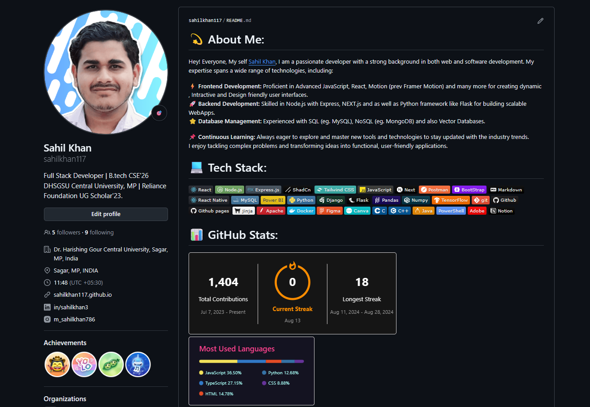

# HinTextify - Hindi OCR Extractor

<p align="center">
  
</p>

<p align="center">
  
  
  
  
</p>

<p align="center">
  <strong>🚀 Advanced Python toolkit for extracting Hindi text from scanned book images</strong>
</p>

<p align="center">
  <em>Leveraging Tesseract OCR with intelligent OpenCV preprocessing for superior accuracy</em>
</p>

<p align="center">
  
</p>

---

## 🎯 Overview

Transform your digitization workflow with **HinTextify** - a powerful OCR solution designed specifically for Hindi manuscripts and books. Built with enterprise-grade image preprocessing and Unicode compliance, this tool delivers production-ready text extraction from scanned documents.

## ✨ Key Features

### 🔤 Multi-Language Support
- Native Hindi (Devanagari) OCR
- Mixed Hindi+English processing  
- UTF-8 compliant output

### 🖼️ Smart Image Processing
- Adaptive noise reduction
- Intelligent binarization
- Contrast optimization

### ⚡ Batch Processing  
- Process entire folders
- Preserved file naming
- Automated workflow

### 🎯 High Accuracy
- OpenCV preprocessing pipeline
- Optimized for 300-600 DPI
- Production-ready results

---

## 📁 Project Structure

```
📦 HinTextify/
├── 📂 Book/                    # Input folder for images
│   ├── 🖼️ page001.jpg
│   ├── 🖼️ page002.png
│   └── 🖼️ ...
├── 📂 Book_text/               # Output folder for text files  
│   ├── 📄 page001.txt
│   ├── 📄 page002.txt
│   └── 📄 ...
├── 🐍 main.py                 # Main OCR script
├── 📋 requirements.txt        # Python dependencies
├── ⚙️ pyproject.toml          # Modern dependency management
└── 📖 README.md               # This file
```

---

## 🚀 Quick Start

### Prerequisites

Before you begin, ensure you have:
- **Python 3.10+** installed
- **Tesseract OCR 5.0+** with Hindi language pack
- **Git** (for cloning the repository)

### Installation

#### Step 1: Install Tesseract OCR

**Windows:**
1. Download from [UB Mannheim Tesseract](https://github.com/UB-Mannheim/tesseract/wiki)
2. Install to: `C:\Users\{USERNAME}\AppData\Local\Programs\Tesseract-OCR\`
3. Ensure Hindi language pack is selected during installation

**Linux (Ubuntu/Debian):**
```bash
sudo apt update
sudo apt install tesseract-ocr tesseract-ocr-hin
```

**macOS:**
```bash
brew install tesseract tesseract-lang
```

#### Step 2: Setup HinTextify

**Option A: Using pip**
```bash
git clone https://github.com/sahilkhan117/HinTextify.git
cd HinTextify

# Create virtual environment (recommended)
python -m venv venv
source venv/bin/activate  # Linux/macOS
# venv\Scripts\activate   # Windows

pip install -r requirements.txt
```

**Option B: Using uv (faster)**
```bash
pip install uv
git clone https://github.com/sahilkhan117/HinTextify.git
cd HinTextify
uv sync
```

### Usage

1. **Add your images** to the `Book/` folder
2. **Run the OCR script:**
   ```bash
   python main.py
   ```
3. **Find extracted text** in the `Book_text/` folder

---

## ⚙️ Configuration

Update paths in `main.py` if needed:

```python
# Tesseract executable path (Windows)
pytesseract.pytesseract.tesseract_cmd = r"C:\Users\{USERNAME}\AppData\Local\Programs\Tesseract-OCR\tesseract.exe"

# Folders
input_folder = "Book"
output_folder = "Book_text"

# Language settings
language = 'hin+eng'  # Hindi + English
```

---

## 📊 Performance Guidelines

### Image Quality Recommendations

| Parameter | Recommended Value | Impact |
|-----------|------------------|--------|
| **Resolution** | 300-600 DPI | Higher = Better accuracy |
| **Format** | PNG, TIFF | Lossless = Better quality |
| **Color** | Grayscale | Faster processing |
| **File Size** | < 10MB | Optimal memory usage |

### Processing Pipeline

**Input Image** → **Preprocessing** → **Grayscale Conversion** → **Noise Removal** → **Binarization** → **OCR Processing** → **Text Output**

---

## 💡 Usage Examples

### Example 1: Pure Hindi Content
```python
# Configure for Hindi-only documents
config = {
    'lang': 'hin',
    'psm': 6,  # Uniform block of text
    'oem': 1   # LSTM neural nets engine
}
```

### Example 2: Mixed Language Documents
```python
# Configure for Hindi + English mixed content
config = {
    'lang': 'hin+eng', 
    'psm': 3,  # Automatic page segmentation
    'oem': 1
}
```

### Example 3: Batch Processing Results

**Input:**
```
Book/
├── chapter01_page001.jpg
├── chapter01_page002.jpg
├── chapter02_page001.png
└── manuscript_page045.tiff
```

**Output:**
```
Book_text/
├── chapter01_page001.txt ✅ (2.3KB)
├── chapter01_page002.txt ✅ (1.8KB)
├── chapter02_page001.txt ✅ (2.1KB)
└── manuscript_page045.txt ✅ (2.7KB)
```

---

## 🐛 Troubleshooting

### Common Issues & Solutions

**❌ TesseractNotFoundError**
```bash
# Update the tesseract path in main.py
pytesseract.pytesseract.tesseract_cmd = r"YOUR_ACTUAL_TESSERACT_PATH"
```

**❌ Hindi Language Pack Missing**
```bash
# Download and install Hindi traineddata
wget https://github.com/tesseract-ocr/tessdata/raw/main/hin.traineddata
# Place in: tesseract/tessdata/hin.traineddata
```

**❌ Poor OCR Accuracy**
```python
# Improve image preprocessing
def enhance_image_quality(image):
    # Increase contrast and brightness
    alpha = 1.5  # Contrast control
    beta = 0     # Brightness control
    return cv2.convertScaleAbs(image, alpha=alpha, beta=beta)
```

---

## 🤝 Contributing

We welcome contributions! Here's how you can help:

- 🐛 **[Report Bugs](../../issues)**
- 💡 **[Request Features](../../issues)**
- 📖 **Improve Documentation** 
- 🧪 **Add Tests**

### Development Setup

```bash
# Fork the repository
git clone https://github.com/yourusername/HinTextify.git
cd HinTextify

# Create feature branch
git checkout -b feature/your-feature-name

# Install dev dependencies
pip install -r requirements-dev.txt

# Make changes and test
python -m pytest tests/

# Submit pull request
```

---

## 📄 License

**MIT License** © 2024 HinTextify

This project is licensed under the MIT License - see the [LICENSE](LICENSE) file for details.

---

## 🙏 Acknowledgments

- **[Tesseract OCR](https://github.com/tesseract-ocr/tesseract)** - Google's powerful OCR engine
- **[OpenCV](https://opencv.org/)** - Computer vision and image processing library  
- **[Python Community](https://www.python.org/)** - Amazing programming language and ecosystem

---

## 📞 Support & Contact

<p align="center">
  <a href="../../stargazers"></a>
  <a href="../../issues"></a>
  <a href="../../issues"></a>
</p>

<p align="center">
  <strong>Made with ❤️ for the Hindi digitization community</strong>
</p>

<p align="center">
  <strong>Happy OCR Processing! 📚 ➡️ 📝</strong>
</p>
