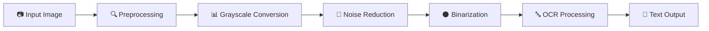

#  HinTextify - Hindi OCR Extractor
<div align="center">


**🚀 Advanced Python toolkit for extracting Hindi text from scanned book images**

*Leveraging Tesseract OCR with intelligent OpenCV preprocessing for superior accuracy*

---


---

</div>

## 🎯 Overview

Transform your digitization workflow with this powerful OCR solution designed specifically for **Hindi manuscripts and books**. Built with enterprise-grade image preprocessing and Unicode compliance, this tool delivers production-ready text extraction from scanned documents.

### 🏆 Key Highlights

<table>
<tr>
<td>

**🔤 Multi-Language Support**
- Native Hindi (Devanagari) OCR
- Mixed Hindi+English processing
- UTF-8 compliant output

</td>
<td>

**🖼️ Smart Image Processing**
- Adaptive noise reduction
- Intelligent binarization
- Contrast optimization

</td>
</tr>
<tr>
<td>

**⚡ Batch Processing**
- Process entire folders
- Preserved file naming
- Automated workflow

</td>
<td>

**🎯 High Accuracy**
- OpenCV preprocessing pipeline
- Optimized for 300-600 DPI
- Production-ready results

</td>
</tr>
</table>

---

## 📁 Project Architecture

```
📦 hindi-book-ocr/
├── 📂 Book/                 # 📥 Input Directory
│   ├── 🖼️ page001.jpg
│   ├── 🖼️ page002.png
│   └── 🖼️ ...
├── 📂 Book_text/            # 📤 Output Directory  
│   ├── 📄 page001.txt
│   ├── 📄 page002.txt
│   └── 📄 ...
├── 🐍 main.py              # 🚀 Core OCR Engine
├── 📋 requirements.txt     # 📦 Dependencies (pip)
├── ⚙️ pyproject.toml       # 📦 Dependencies (uv)
├── 📖 README.md            # 📚 Documentation
└── 🔧 config.py           # ⚙️ Configuration (optional)
```

---

## 🛠️ Installation Guide

### Prerequisites

<div align="center">

| Component | Version | Platform |
|-----------|---------|----------|
| 🐍 Python | 3.10+ | Cross-platform |
| 🔍 Tesseract | 5.0+ | Windows/Linux/macOS |
| 📚 Hindi Language Pack | Latest | Required |

</div>

---

### Step 1: Install Tesseract OCR

#### 🪟 Windows Installation

1. **Download & Install**
   ```bash
   # Download from official repository
   https://github.com/UB-Mannheim/tesseract/wiki
   ```

2. **Default Installation Path**
   ```
   C:\Users\{USERNAME}\AppData\Local\Programs\Tesseract-OCR\
   ```

3. **Verify Installation**
   ```cmd
   tesseract --version
   tesseract --list-langs
   ```

#### 🐧 Linux Installation

```bash
# Ubuntu/Debian
sudo apt update
sudo apt install tesseract-ocr tesseract-ocr-hin

# CentOS/RHEL/Fedora
sudo dnf install tesseract tesseract-langpack-hin
```

#### 🍎 macOS Installation

```bash
# Using Homebrew
brew install tesseract tesseract-lang
```

---

### Step 2: Python Environment Setup

#### Option A: Using pip (Traditional)

```bash
# Clone or download the project
git clone https://github.com/sahilkhan117/hindi-ocr.git
cd hindi-ocr

# Create virtual environment (recommended)
python -m venv venv
source venv/bin/activate  # Linux/macOS
# or
venv\Scripts\activate     # Windows

# Install dependencies
pip install -r requirements.txt
```

#### Option B: Using uv (Modern & Faster)

```bash
# Install uv if not already installed
pip install uv

# Setup project
uv sync
```

---

## 🚀 Quick Start

### Basic Usage

1. **Prepare Your Images**
   ```bash
   # Place scanned images in the Book folder
   cp /path/to/your/scans/* ./Book/
   ```

2. **Execute OCR Processing**
   ```bash
   # Standard execution
   python main.py
   
   # With uv (recommended)
   uv run main.py
   ```

3. **Retrieve Results**
   ```bash
   # Check extracted text files
   ls -la Book_text/
   ```

### Advanced Configuration

```python
# main.py - Customization Options

# Input/Output Directories
INPUT_FOLDER = "Book"
OUTPUT_FOLDER = "Book_text"

# Tesseract Configuration
TESSERACT_PATH = r"C:\Users\{USERNAME}\AppData\Local\Programs\Tesseract-OCR\tesseract.exe"
LANGUAGE_CONFIG = 'hin+eng'  # Hindi + English

# Image Processing Parameters
DPI_SETTING = 300
PREPROCESSING_ENABLED = True
```

---

## 📊 Performance Optimization

### Image Quality Guidelines

| Parameter | Recommended | Notes |
|-----------|-------------|--------|
| **Resolution** | 300-600 DPI | Higher DPI = Better accuracy |
| **Format** | PNG, TIFF | Lossless compression preferred |
| **Color Mode** | Grayscale | Reduces processing time |
| **File Size** | < 10MB | For optimal memory usage |

### Processing Pipeline



---

## 📈 Usage Examples

### Example 1: Single Language Processing

```python
# For pure Hindi content
config = {
    'lang': 'hin',
    'psm': 6,  # Uniform block of text
    'oem': 1   # Neural nets LSTM engine
}
```

### Example 2: Mixed Language Content

```python
# For Hindi + English mixed content
config = {
    'lang': 'hin+eng',
    'psm': 3,  # Fully automatic page segmentation
    'oem': 1
}
```

### Example 3: Batch Processing Results

**Input Structure:**
```
Book/
├── chapter01_page001.jpg
├── chapter01_page002.jpg
├── chapter02_page001.png
└── manuscript_page045.tiff
```

**Output Results:**
```
Book_text/
├── chapter01_page001.txt  ✅ 2.3KB extracted
├── chapter01_page002.txt  ✅ 1.8KB extracted  
├── chapter02_page001.txt  ✅ 2.1KB extracted
└── manuscript_page045.txt ✅ 2.7KB extracted
```

---

## 🔧 Troubleshooting

<details>
<summary><strong>❌ Common Issues & Solutions</strong></summary>

### Issue 1: Tesseract Not Found
```bash
# Error: TesseractNotFoundError
# Solution: Update tesseract path in main.py
pytesseract.pytesseract.tesseract_cmd = r"ACTUAL_PATH_TO_TESSERACT"
```

### Issue 2: Hindi Language Pack Missing
```bash
# Error: TesseractError: (2, 'Usage: tesseract...')
# Solution: Download hindi traineddata
wget https://github.com/tesseract-ocr/tessdata/raw/main/hin.traineddata
# Place in: tesseract/tessdata/hin.traineddata
```

### Issue 3: Poor OCR Accuracy
```python
# Solution: Adjust preprocessing parameters
def enhance_image_quality(image):
    # Increase contrast
    alpha = 1.5  # Contrast
    beta = 0     # Brightness
    return cv2.convertScaleAbs(image, alpha=alpha, beta=beta)
```

</details>

---

## 🤝 Contributing

We welcome contributions from the community! Here's how you can help:

<div align="center">

| 🐛 **Bug Reports** | 🆕 **Feature Requests** | 📖 **Documentation** | 🧪 **Testing** |
|-------------------|------------------------|---------------------|---------------|

</div>

### Development Setup

```bash
# Fork and clone the repository
git clone https://github.com/yourusername/hindi-book-ocr.git
cd hindi-book-ocr

# Create development branch
git checkout -b feature/your-feature-name

# Install development dependencies
pip install -r requirements-dev.txt

# Make your changes and test
python -m pytest tests/

# Submit pull request
```

---

## 📄 License & Credits

<div align="center">

**MIT License** © 2024 Hindi Book OCR Extractor

*Built with ❤️ for the Hindi digitization community*

### 🙏 Acknowledgments

- **[Tesseract OCR](https://github.com/tesseract-ocr/tesseract)** - Google's OCR Engine
- **[OpenCV](https://opencv.org/)** - Computer Vision Library  
- **[Python Community](https://www.python.org/)** - Programming Language

---

### 🔗 Connect & Support

[](../../stargazers)
[](../../issues)
[](../../issues)

**Made with 🧠 and ☕ | Happy OCR Processing! 📚➡️📝**

</div>
